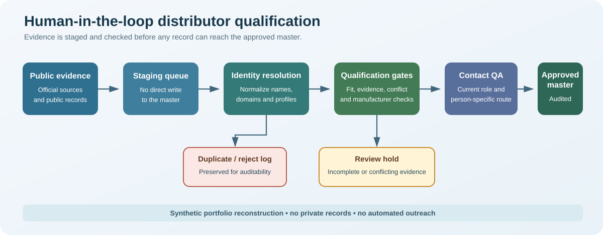
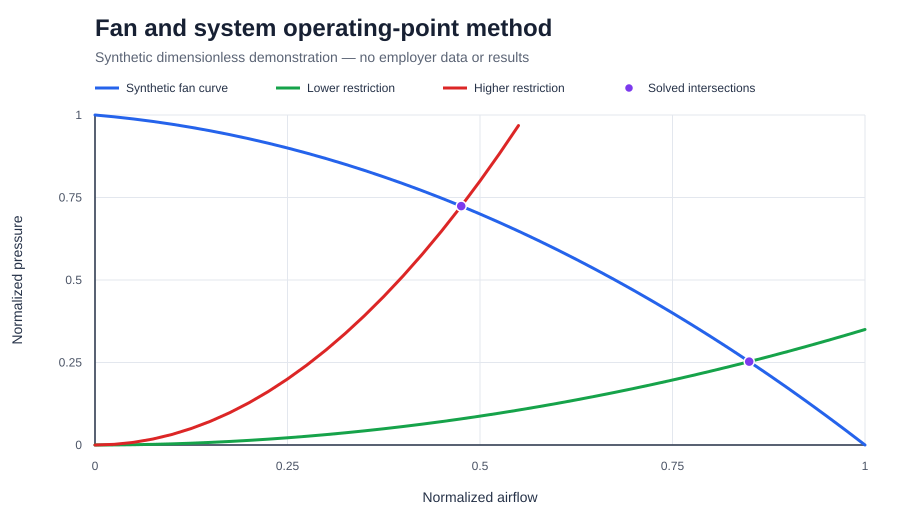

# Yasamin Shahbazi

Computational & R&D Engineer | Medical-Device Innovation | Technical Product & Operations

[LinkedIn](https://www.linkedin.com/in/yasaminshahbazi/) | [Email](mailto:yasaminshahbazzi@gmail.com)

I use computational mechanics and multiphysics modelling to support medical-device and advanced-engineering product development. My work connects first-principles simulation, instrumentation and prototyping, validation-aware analysis, automation, and cross-functional delivery—positioning me for industrial R&D, product-development, and technical-innovation roles.

## Selected engineering and technical-systems work

### 1. Custom finite-strain modelling of a pH-sensitive hydrogel sensor

[View the case study](projects/01-hydrogel-multiphysics/README.md)

- Independently implemented a finite-strain electro-chemo-mechanical model in COMSOL using custom constitutive variables and weak-form PDEs.
- Coupled a hyperelastic network, Flory-Huggins and ionic swelling stresses, three-species Nernst-Planck transport, Poisson electrostatics, and electrical traction.
- Published a [sanitized equation manifest](projects/01-hydrogel-multiphysics/code/HydrogelModelDefinition.java) with an explicit [technical audit](projects/01-hydrogel-multiphysics/MODEL_AUDIT.md).
- Studied transient swelling in a wider graduate investigation after changing the surrounding solution from pH 4 to pH 5-8.
- Extended the model to compression and tension loading and evaluated displacement, ion concentration, volume change, electric potential, and resistance trends.
- Benchmarked the computational behaviour against published literature; no experimental validation is claimed.

### 2. Hyperelastic ABS UMAT with a collaborative auxetic application

[View the case study and sanitized Fortran](projects/02-abaqus-umat-auxetic/README.md)

- Implemented a polynomial hyperelastic material model as an Abaqus/Standard UMAT.
- Compared the implementation with published tensile data and Abaqus' native hyperelastic model.
- Contributed to an auxetic application in a two-person university project.
- Withheld the shared geometry, design parameters, meshes, and auxetic simulation results.
- Removed proprietary solver files and replaced an externally credited helper routine in the public code copy.

### 3. Arduino ultrasonic strain-measurement prototype

[View the prototype, firmware, and analysis code](projects/03-ultrasonic-strain/README.md)

- Built an educational tensile-test prototype using an Arduino Uno and HY-SRF05 ultrasonic sensor.
- Measured specimen length through staged loading and calculated Green-Lagrange strain.
- Reconstructed the public firmware and analysis workflow with explicit calibration and uncertainty limitations.

### 4. AI-assisted distributor discovery and qualification system

[View the sanitized case study, synthetic data, and tested pipeline](projects/04-distributor-qualification/README.md)

- Defined qualification, identity-resolution, evidence, contactability, approval, and QA rules for a private medical-device distributor workflow.
- Directed an AI-assisted implementation with staged review, deterministic gates, deduplication, audit logs, and scheduled research cycles.
- The private deployment managed 613 distributor records and 1,689 contact records at the verified snapshot; only aggregate metrics are disclosed.
- Published a standard-library Python reconstruction with fictional `.example` data and tests for high-risk data-quality rules.
- No employer, product, market, company, contact, competitor, source, or live-sheet information is included.

### 5. Forced-air thermal-management analysis workflow

[View the independent synthetic reconstruction](projects/05-thermal-management/README.md)

- Created and documented private COMSOL CFD and conjugate heat-transfer analyses for an internal medical-device thermal-management subsystem.
- Applied parametric studies, mesh-independence assessment, fan/system operating-point reasoning, and interpretation of pressure-loss and temperature trends.
- Physical testing was performed by colleagues; I claim simulation and analysis only.
- Published an independently built, AI-assisted Python demonstration using fictional dimensionless equations, synthetic data, and deterministic tests.
- No employer geometry, values, models, reports, experiments, or product results are included.

## Additional technical work

- Total and Updated Lagrangian user-element formulations for nonlinear cantilever bending in Abaqus.
- Hyperelastic and hyper-viscoelastic UMAT studies, including penalty-based incompressibility and Prony-series relaxation.
- Team-based Arduino, HX711, load-cell, stepper-motor, and LabVIEW workflows for compression, tension, relaxation, and load-unload testing.
- Shape-memory modelling and a two-person auxetic university project; shared auxetic geometry and results are not published.

## Technical toolkit

**Simulation:** Abaqus/Standard, COMSOL Multiphysics, finite element analysis, weak-form PDEs, coupled-field modelling, CFD, fluid-structure interaction, heat transfer, contact mechanics, large deformation

**Programming and engineering tools:** Python, Fortran, MATLAB, Arduino, LabVIEW, Siemens NX, Excel, Google Sheets

**Delivery:** Technical product development, project leadership, technical documentation, workflow automation, research synthesis, entity resolution, human-in-the-loop quality control, cross-functional coordination, risk awareness, market and distributor research

## Education

- Bachelor of Engineering in Biomedical Engineering, Islamic Azad University, Central Tehran Branch
- Graduate studies at K. N. Toosi University of Technology - completed and passed all coursework and submitted a research thesis, then chose to leave the programme before formal degree completion

## Portfolio boundaries

This repository contains sanitized university work and independent portfolio reconstructions only. It intentionally excludes confidential employer models, operational source code, live spreadsheets, product information, company and contact records, solver databases, personal photographs, and unverified publication claims. The distributor-system case study uses fictional data and user-approved aggregate metrics only; the thermal-management case study uses fictional dimensionless equations and synthetic results only.

See [Attribution and public-scope notes](ATTRIBUTION.md) for the ownership decisions behind the selected projects.
