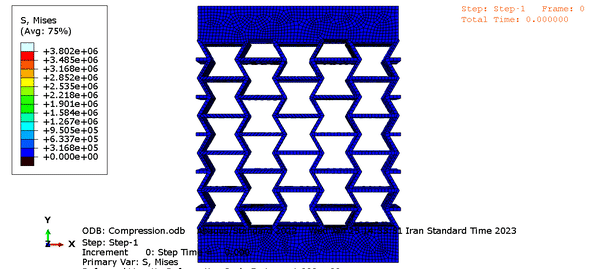
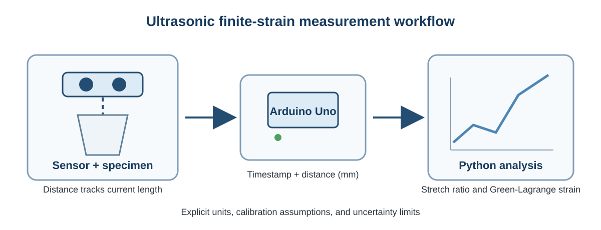

# Yasamin Shahbazi

Computational Mechanics Engineer | Medical Device R&D | Technical Project & Operations Lead

[LinkedIn](https://www.linkedin.com/in/yasaminshahbazi/) | [Email](mailto:yasaminshahbazzi@gmail.com) | Tehran, Iran | Open to relocation to Spain

I work across finite element analysis, CFD, multiphysics modelling, computational biomechanics, and cross-functional engineering delivery. My strongest projects combine first-principles modelling with practical prototyping, validation-aware analysis, and clear technical communication.

## Selected engineering work

### 1. Custom finite-strain modelling of a pH-sensitive hydrogel sensor

[View the case study](projects/01-hydrogel-multiphysics/README.md)

- Independently implemented a finite-strain electro-chemo-mechanical model in COMSOL using custom constitutive variables and weak-form PDEs.
- Coupled a hyperelastic network, Flory-Huggins and ionic swelling stresses, three-species Nernst-Planck transport, Poisson electrostatics, and electrical traction.
- Published a [sanitized equation manifest](projects/01-hydrogel-multiphysics/code/HydrogelModelDefinition.java) with an explicit [technical audit](projects/01-hydrogel-multiphysics/MODEL_AUDIT.md).
- Studied transient swelling in a wider graduate investigation after changing the surrounding solution from pH 4 to pH 5-8.
- Extended the model to compression and tension loading and evaluated displacement, ion concentration, volume change, electric potential, and resistance trends.
- Benchmarked the computational behaviour against published literature; no experimental validation is claimed.

### 2. Hyperelastic ABS UMAT and re-entrant auxetic compression

[View the case study and sanitized Fortran](projects/02-abaqus-umat-auxetic/README.md)

- Implemented a polynomial hyperelastic material model as an Abaqus/Standard UMAT.
- Compared the implementation with published tensile data and Abaqus' native hyperelastic model.
- Applied the material model to a re-entrant auxetic structure under 8 mm compression.
- Removed proprietary solver files and replaced an externally credited helper routine in the public code copy.

### 3. Arduino ultrasonic strain-measurement prototype

[View the prototype, firmware, and analysis code](projects/03-ultrasonic-strain/README.md)

- Built an educational tensile-test prototype using an Arduino Uno and HY-SRF05 ultrasonic sensor.
- Measured specimen length through staged loading and calculated Green-Lagrange strain.
- Reconstructed the public firmware and analysis workflow with explicit calibration and uncertainty limitations.

## Additional technical work

- Total and Updated Lagrangian user-element formulations for nonlinear cantilever bending in Abaqus.
- Hyperelastic and hyper-viscoelastic UMAT studies, including penalty-based incompressibility and Prony-series relaxation.
- Team-based Arduino, HX711, load-cell, stepper-motor, and LabVIEW workflows for compression, tension, relaxation, and load-unload testing.
- Shape-memory and auxetic polymer-structure modelling in collaborative university projects.

## Technical toolkit

**Simulation:** Abaqus/Standard, COMSOL Multiphysics, finite element analysis, weak-form PDEs, coupled-field modelling, CFD, fluid-structure interaction, heat transfer, contact mechanics, large deformation

**Programming and engineering tools:** Fortran, MATLAB, Arduino, LabVIEW, Siemens NX, Excel

**Delivery:** Technical documentation, workflow automation, research synthesis, cross-functional coordination, risk awareness, market and distributor research

## Education

- Bachelor of Engineering in Biomedical Engineering, Islamic Azad University, Central Tehran Branch
- Graduate studies in Materials Science and Engineering, K. N. Toosi University of Technology - coursework completed and thesis submitted; degree not awarded

## Portfolio boundaries

This repository contains sanitized university work and portfolio reconstructions only. It intentionally excludes confidential employer models, product information, solver databases, personal photographs, and unverified publication claims.

See [Attribution and public-scope notes](ATTRIBUTION.md) for the ownership decisions behind the selected projects.
