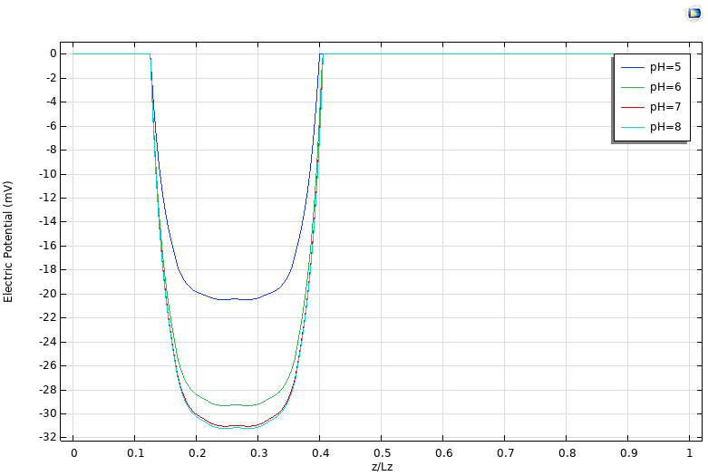
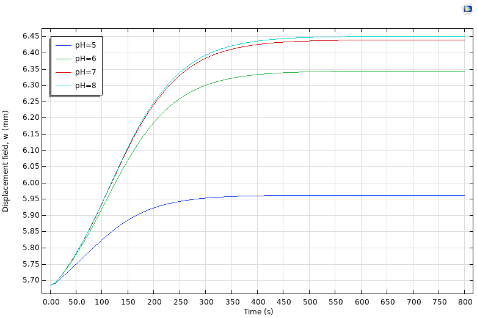
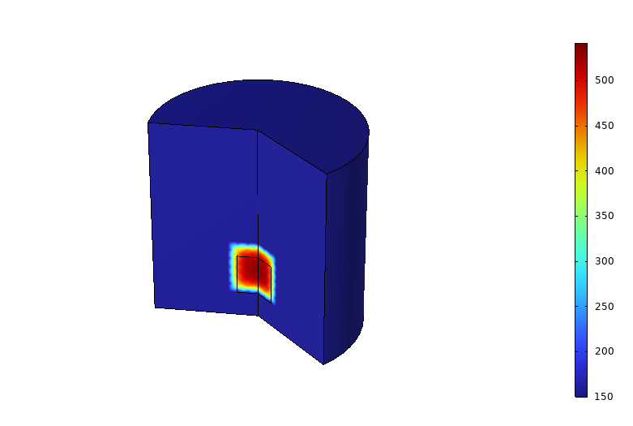

# Transient multiphysics modelling of a pH-sensitive hydrogel sensor

## Project at a glance

| | |
|---|---|
| Role | Individual graduate research; first author of a submitted conference manuscript |
| Tools | COMSOL Multiphysics, weak-form PDEs, nonlinear solid mechanics |
| Physics | Ion transport, electric potential, osmotic swelling, hyperelastic large deformation |
| Validation | Literature benchmark only; no experimental validation |
| Public scope | Case study and selected simulation figures; no proprietary COMSOL model file |

## Engineering question

How does a pH-sensitive polyelectrolyte hydrogel respond over time when the surrounding solution changes, and how do external tensile or compressive loads affect its deformation and electrical response?

The work treated the hydrogel as a compressible hyperelastic solid immersed in an ionic solution. Electrochemical fields were implemented through weak-form equations and coupled to finite-deformation solid mechanics.

## Model configuration

- Initial stationary equilibrium in a pH 4 solution.
- Transient transfer to solutions at pH 5, 6, 7, and 8.
- Positive and negative ion concentration in the bath: 150 mM.
- Transient window: 800 seconds.
- Fully coupled electro-chemo-mechanical solution.
- Mechanical extensions:
  - Compression from 0 to 4 kPa.
  - Tension from 0 to 20 kPa at pH 8.

## Selected results

The model predicted greater swelling and a larger gel-solution electric-potential difference as pH increased.

The transient vertical-displacement response approached a plateau over the 800-second window. The separation between pH 5 and the higher-pH cases was larger than the separation among pH 6-8.

The project report recorded the following volume ratios:

- 2.60 after equilibrium at pH 4.
- 2.83 after equilibrium at pH 8.
- 2.84 at pH 8 with 20 kPa tensile loading.

The tensile-load result suggested that, for this parameter set, the chemical swelling response dominated the small change in total volume caused by the applied load.

## Validation and limitations

The computational trends were benchmarked against published hydrogel theories and numerical studies. This was not an experimental validation, and no physical hydrogel synthesis or laboratory sensor testing is claimed.

Important model limitations included sensitivity to constitutive parameters and nonlinear convergence. Some parameter changes, including changes to the Flory-Huggins interaction parameter, prevented convergence. The pH response also became less separated among the higher-pH cases.

## Research output

A first-author Persian-language manuscript based on this model was submitted to an IMAT conference. Submission is confirmed; acceptance and publication are not claimed in this public portfolio until documentary evidence is found.

## Literature used for benchmarking

1. Marcombe et al., "A theory of constrained swelling of a pH-sensitive hydrogel," *Soft Matter* 6 (2010), [doi:10.1039/B917211D](https://doi.org/10.1039/B917211D).
2. Liu et al., "Multiphysics modeling of responsive deformation of dual magnetic-pH-sensitive hydrogel," *International Journal of Solids and Structures* 190 (2020), [doi:10.1016/j.ijsolstr.2019.11.002](https://doi.org/10.1016/j.ijsolstr.2019.11.002).
3. Liu et al., "Transient modeling of magneto-chemo-electro-mechanical behavior of magnetic polyelectrolyte hydrogel," *Mechanics of Materials* 155 (2021), [doi:10.1016/j.mechmat.2021.103783](https://doi.org/10.1016/j.mechmat.2021.103783).
4. Narayan and Anand, "A coupled electro-chemo-mechanical theory for polyelectrolyte gels," *Journal of the Mechanics and Physics of Solids* 159 (2022), [doi:10.1016/j.jmps.2021.104734](https://doi.org/10.1016/j.jmps.2021.104734).

[Back to portfolio](../../README.md)

