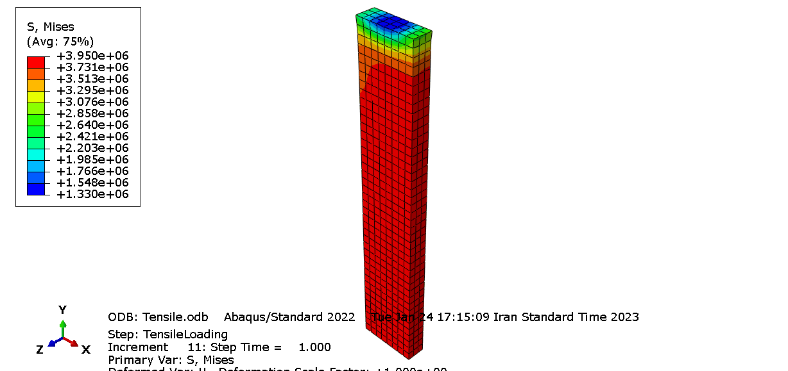
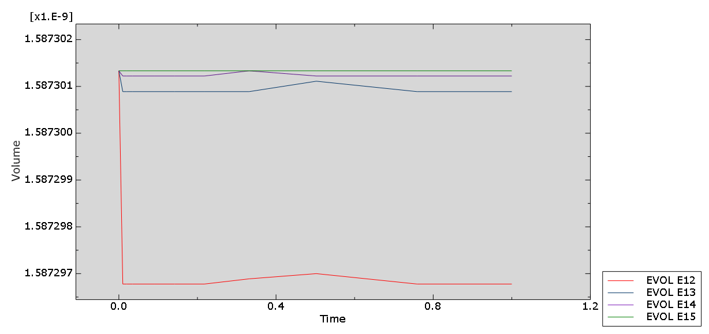
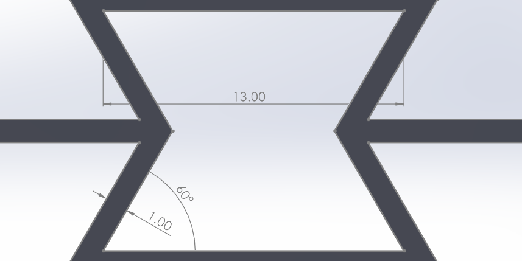

# Hyperelastic ABS UMAT and re-entrant auxetic compression

## Project at a glance

| | |
|---|---|
| Role | Individual finite-element coursework project and report |
| Tools | Abaqus/Standard 2022, Fortran UMAT, nonlinear finite elements |
| Material model | Second-order polynomial hyperelastic strain-energy function |
| Verification | Published tensile data and Abaqus native hyperelastic model |
| Application | Re-entrant auxetic ABS structure under compression |

## Engineering objective

The project had two connected goals:

1. Implement a finite-deformation hyperelastic material law for ABS as an Abaqus UMAT.
2. Use the verified material model to study the nonlinear compression of a re-entrant auxetic structure.

## Constitutive implementation

The UMAT evaluates the right Cauchy-Green tensor, its invariants, a second-order polynomial strain-energy function, second Piola-Kirchhoff stress, Cauchy stress, and the material Jacobian supplied to Abaqus.

Near-incompressibility was handled using a penalty parameter. The project explicitly explored the numerical trade-off: too small a penalty allowed volume drift, while too large a value harmed convergence.

The public file is a sanitized coursework implementation:

- [View the Fortran UMAT](code/umat_abs_sanitized.for)
- Solver databases, journals, and institution-specific input files are omitted.
- An externally credited general matrix-inversion helper from the coursework copy was removed and replaced with a local analytical 3x3 inverse.
- The sanitized file has not been recompiled here because an Abaqus-compatible Fortran toolchain is unavailable in this environment.

## Verification

The tensile model was compared with published ABS data and with Abaqus' native polynomial hyperelastic implementation. The project report found close agreement among the experimental curve, the native model, and the UMAT response.

| Sanitized UMAT result | Abaqus native model |
|---|---|
|  |  |

The element-volume study was used to select a penalty magnitude that preserved near-incompressibility without causing solver failure.

## Auxetic application

The re-entrant unit geometry used a 60-degree angle, 1 mm ligament thickness, and a 13 mm internal span. The Abaqus model used a 1 mm mesh, hybrid formulation, hourglass control, and 8 mm imposed compression.

The simulation showed the expected inward lateral motion during compression, consistent with negative effective Poisson behaviour, together with a nonlinear force-displacement response.

## Related work

Separate coursework implemented Total and Updated Lagrangian user elements for nonlinear cantilever bending. That study compared both formulations and identified a small discrepancy caused by using the same elastic-property tensor representation in the current and reference configurations.

## Material-data reference

The ABS parameters and comparison data were drawn from S. Kouchakzadeh and K. Narooei, "Simulation of piezoresistance and deformation behavior of a flexible 3D printed sensor considering the nonlinear mechanical behavior of materials," *Sensors and Actuators A: Physical* 332 (2021), [doi:10.1016/j.sna.2021.113214](https://doi.org/10.1016/j.sna.2021.113214).

[Back to portfolio](../../README.md)

