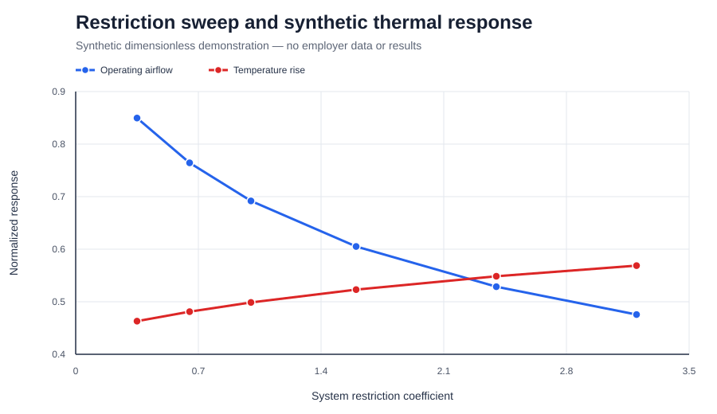

# Forced-air thermal-management analysis workflow

## Project at a glance

| | |
|---|---|
| Private-work role | COMSOL CFD and conjugate heat-transfer modelling, parametric analysis, mesh assessment, interpretation, and technical reporting |
| Public implementation | Independent, AI-assisted Python standard-library reconstruction with deterministic tests |
| Public data | Fictional dimensionless equations and explicitly labelled synthetic results |
| Experimental boundary | Physical testing was performed by colleagues; I claim simulation and analysis only |
| Privacy boundary | No employer, product, geometry, material, boundary-condition, fan, operating, test, or performance data |

## Engineering context

Forced-air thermal analysis requires more than reporting a temperature contour. The airflow produced by a fan depends on the pressure resistance of the complete flow path, and numerical conclusions must be checked for mesh sensitivity before they inform design decisions.

In private medical-device work, I created and documented COMSOL CFD and conjugate heat-transfer analyses for an internal thermal-management subsystem. My work included:

- Parameterising airflow and flow-path restrictions.
- Representing fan and system behaviour at their operating point.
- Studying pressure-loss and temperature-response trends.
- Comparing modelling and turbulence-treatment choices.
- Performing mesh-independence assessment.
- Interpreting limitations and documenting design implications.

Colleagues performed the associated physical tests. I do not claim that I designed or ran those experiments, and no private test result is reproduced here.

## Public reconstruction

The repository contains a fresh, dimensionless demonstration of the analysis logic:

- [Synthetic workflow source](src/thermal_workflow.py)
- [Deterministic tests](tests/test_thermal_workflow.py)
- [Synthetic restriction sweep](data/restriction_sweep.synthetic.csv)
- [Synthetic mesh sequence](data/mesh_convergence.synthetic.csv)
- [Machine-readable QA summary](data/summary.synthetic.json)

The public model uses fully disclosed fictional equations:

```text
Fan pressure:              P_f = 1 - 0.20 q - 0.80 q²
System pressure:           P_s = K q²
Synthetic temperature:     ΔT = 0.22 + 0.78 / (1 + 2.60 q)
```

These equations are teaching surrogates. They are not fitted to a product, fan, experiment, or CFD result.


The curve intersections demonstrate why increasing system resistance reduces operating airflow. The synthetic response then demonstrates the expected workflow relationship between lower airflow and a higher monitored temperature rise.



## Verified synthetic result

| Check | Result |
|---|---:|
| Restriction cases | 6 |
| Normalized airflow, lowest to highest restriction | 0.850 to 0.476 |
| Synthetic normalized temperature rise | 0.463 to 0.569 |
| Recovered mesh-convergence order | 2.00 |
| Fine-grid GCI for the known synthetic sequence | 0.304% |
| Automated checks | 5 passed |

The mesh values were intentionally generated from a known second-order sequence. Recovering the expected order verifies the convergence-analysis implementation; it is not evidence that a private CFD mesh achieved the same GCI.

## Run the reconstruction

From the repository root:

```bash
python projects/05-thermal-management/src/thermal_workflow.py --output-dir build/thermal-demo/data --asset-dir build/thermal-demo/assets
```

Run the tests:

```bash
python -m unittest discover -s projects/05-thermal-management/tests -v
```

## Boundaries and limitations

- The public implementation is a reduced-order workflow demonstration, not a CFD solver.
- Every number and equation in the public reconstruction is fictional and dimensionless.
- No original model, report, screenshot, geometry, mesh, material, boundary condition, operating point, fan curve, or result is included.
- No experimental execution or validation is claimed.
- The public Python implementation was developed with AI assistance and checked through deterministic tests.
- The project demonstrates analysis structure, numerical QA, interpretation, and privacy-aware technical communication—not product performance.

[Back to portfolio](../../README.md)
